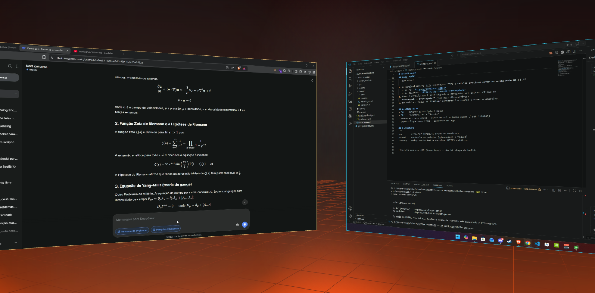
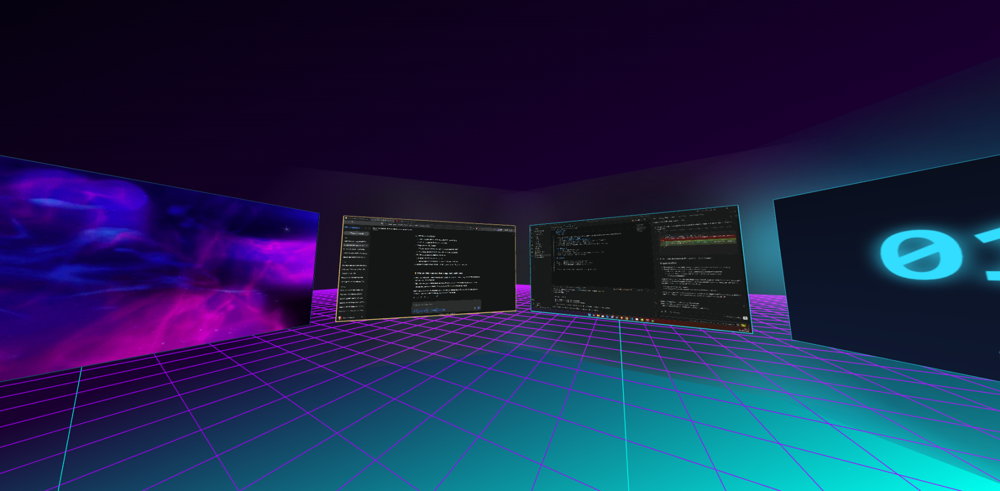

# 🛸 Holo-Screens VR

**Um cockpit de telas-holograma flutuando em 3D, renderizado no seu monitor comum** — navegado
pelo **giroscópio do celular**, pelo **rosto via webcam**, ou pelo mouse. Como usar um headset
de VR sentado (estilo Immersed / Virtual Desktop), só que **sem headset nenhum**.

Você dispõe várias "telas" num arco/cilindro ao seu redor, coloca em cada uma um app capturado,
um vídeo do YouTube, um GIF, um site ou um widget — e passeia entre elas movendo o celular ou a
cabeça, com zoom, foco e efeito de brilho ambiente (ambilight).

> ⚠️ **Plataforma:** o app roda no **Windows** (a ponte de captura/foco de janelas e os widgets de
> sistema usam PowerShell + APIs do Windows). O renderer 3D é web (Three.js) e roda em qualquer
> navegador Chromium (Chrome/Edge/Brave).

---

## 📸 Demonstração

O ambiente virtual em ação — telas-holograma dispostas em 3D ao redor do usuário:





---

## ✨ Funcionalidades

- 🖥️ **Telas em 3D** — quantas quiser (até 8), dispostas num arco/cilindro ao seu redor.
- 📱 **Controle por giroscópio** — abra uma página no celular e mova o aparelho pra olhar em volta.
- 📷 **Head tracking pela webcam** — mova a cabeça pra mover a câmera (MediaPipe FaceLandmarker).
- 🖱️ **Controle por mouse** — arraste pra olhar, scroll pra zoom (fallback sem celular).
- 🪟 **Captura de apps** — coloque qualquer janela/app/monitor ao vivo dentro de uma tela.
- ▶️ **YouTube** — pesquise (sem API key) e assista vídeos embutidos e interativos.
- 🖼️ **Mídia** — fotos e **GIFs animados** (por URL ou arquivo local).
- 🌐 **Web screens** — sites/dashboards interativos via iframe em 3D.
- 🕒 **Widgets** — relógio e **monitor de sistema** (CPU / GPU / RAM + clima).
- 🎯 **Entrar na tela** — traz a janela real pra frente pra você usar com mouse/teclado nativos.
- 🔀 **Reordenar arrastando** + adicionar/remover telas no painel.
- 🎨 **19 temas** (dia/tarde/noite, neon, vaporwave, aurora…) + **modo chuva** com som procedural.
- ✨ **Glow ambilight** — cada tela emite um halo com as cores do próprio conteúdo.
- 💾 **Persistência** — telas, temas e layout voltam após o F5.
- 💻 **Tela de abertura** com arte ASCII e "carregando".

---

## 🚀 Como rodar

### Pré-requisitos
- **Windows 10/11**
- **[Node.js](https://nodejs.org/)** (versão 18 ou superior)
- Um navegador **Chromium** (Chrome, Edge ou Brave) — necessário pra captura de tela
- PC e celular na **mesma rede Wi-Fi** (se for usar o controle por celular)

### Passos
```bash
# 1. clone o repositório
git clone https://github.com/thomasnrs/holo-screenVR.git
cd holo-screenVR

# 2. instale as dependências
npm install

# 3. suba o servidor (gera o certificado HTTPS na 1ª vez)
npm start
```

O terminal vai mostrar dois endereços:

```
  No PC (monitor):  https://localhost:8443/
  No celular:       https://192.168.0.X:8443/phone
```

4. **No PC:** abra `https://localhost:8443/` no Chrome/Edge/Brave.
5. **No celular** (mesma Wi-Fi): abra o endereço `/phone` — **com `https://` e a porta `:8443`**.
6. Como o certificado é autoassinado, o navegador vai avisar → **Avançado → Prosseguir**
   (faça isso nos dois dispositivos).
7. No celular, toque em **Ativar sensores** e comece a mover o aparelho. 🎉

> 💡 Se o celular der **timeout**, libere a porta no Firewall do Windows (PowerShell como Admin):
> ```powershell
> New-NetFirewallRule -DisplayName "Holo-Screens 8443" -Direction Inbound -Protocol TCP -LocalPort 8443 -Action Allow
> ```

---

## 🎮 Controles

### No PC (teclado)
| Tecla | Ação |
|-------|------|
| `G` | Alterna giroscópio / mouse |
| `F` | Liga/desliga head tracking pela **webcam** |
| `R` | Recentraliza a "frente" (e recalibra o rosto) |
| `Tab` | Alterna **navegar ↔ interagir** (clicar em vídeos/sites) |
| `Enter` | Entra na tela central (traz a janela real pra frente) |
| `B` | Próximo tema |
| `C` | Liga/desliga a chuva 🌧️ |
| `H` | Esconde/mostra o HUD |
| scroll | Zoom (aproxima/afasta) |
| arrastar | Olhar em volta (modo mouse) |

### No celular
- **Mover o aparelho** → olha em volta · **Pinça (2 dedos)** → zoom
- **Sensibilidade** (slider) · **Recentralizar** · **Entrar na tela / Cockpit**

### Painel "Criar / capturar telas" (canto superior direito)
- **Tela N ▸ capturar** — escolhe a janela/app pra exibir
- **+ adicionar tela** · **+ relógio 🕒** · **+ sistema 📊** · **+ mídia 🖼️** · **+ youtube ▶️**
- **Arraste** uma linha sobre outra pra **reordenar** · **×** remove a tela

---

## 🏗️ Como funciona

```
┌─────────────────┐      WebSocket (HTTPS)       ┌──────────────────────────┐
│   CELULAR        │  ── orientação + gestos ──►  │   SERVIDOR (Node)        │
│  (giroscópio)    │                              │  relay + ponte Windows   │
└─────────────────┘                              └──────────┬───────────────┘
                                                            │ captura/foco de
┌─────────────────┐                                         │ janelas, stats…
│   PC / MONITOR   │  ◄── posição da câmera, conteúdo ──────┘
│  Three.js 3D     │
│  telas no arco   │  captura de tela via getDisplayMedia (navegador)
└─────────────────┘
```

- **`pc/`** — renderer Three.js que roda no monitor (cena, câmera, telas, widgets, efeitos).
- **`phone/`** — página de controle do celular (giroscópio + toques).
- **`server/`** — servidor HTTPS + relay WebSocket + ponte com o Windows (PowerShell).

Three.js vem via CDN (importmap) — **não há etapa de build**.

---

## 🧰 Stack
- **[Three.js](https://threejs.org/)** — renderização 3D (WebGL + CSS3D)
- **[ws](https://github.com/websockets/ws)** — WebSocket (Node)
- **[MediaPipe Tasks Vision](https://developers.google.com/mediapipe)** — head tracking
- **PowerShell / Win32** — captura, foco de janelas e stats de sistema
- **getDisplayMedia** — captura de telas/janelas no navegador

---

## ⚠️ Limitações conhecidas
- **Captura de tela** só funciona em navegadores Chromium (não no navegador embutido do VS Code).
- Após o **F5**, o vídeo ao vivo das capturas precisa de **1 clique** pra reativar (segurança do
  navegador) — a associação de controle persiste; só o stream visual precisa do reclique.
- **Mídia por arquivo local** não persiste no F5 (vira `blob:`); use **URL** se quiser que volte.
- **Web screens** só abrem sites que permitem iframe (muitos bloqueiam via `X-Frame-Options`).
- **Head tracking** precisa de boa iluminação e consome CPU/GPU.

---

## 📄 Licença
MIT — use, modifique e divirta-se. 🛸
